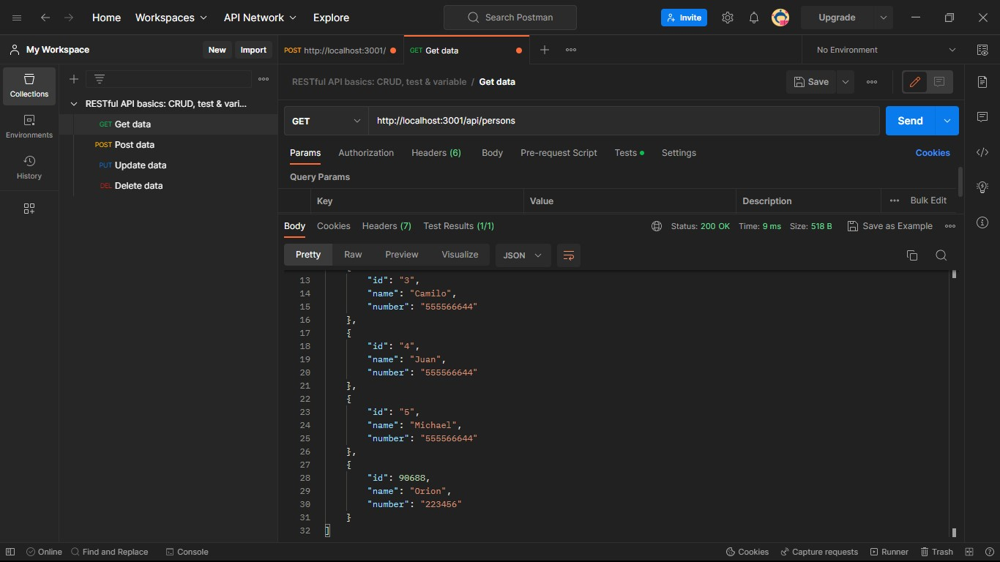

# Make It Real - Mi-primera-API-con-express


This is a solution to the Mi-primera-API-con-express
project of the Make It Real course.

## Table of contents

- [Overview](#overview)
  - [The challenge](#the-challenge)
  - [Screenshot](#screenshot)
- [My process](#my-process)
  - [Built with](#built-with)
  - [What I learned](#what-i-learned)
  - [Continued development](#continued-development)
  - [Useful resources](#useful-resources)
- [Author](#author)
- [Acknowledgments](#acknowledgments)


## Overview

### The challenge

Users should be able to:

- read the info
- read all entries
- read a single entry
- create an entry
- delete an entry

### Screenshot




## My process

### Built with

- Express
- Morgan
- Postman

### What I learned

I learned how to use Postman to test the created routes i really liked how it works,also learned about npm ,express is really helpfull to create API´s 

```js
const express = require("express");
const morgan = require("morgan");

const app = express();
const port = 3001;
//midlewares
app.use(express.json());
app.use(morgan("tiny"));
app.use(express.static("build"));

```
```js
app.get("/info", (req, res) =>
  res.send(
    `Phonebook has info for ${persons.length} people <br> <br> ${new Date()}`
  )
);
```
### Continued development

- Express 
- API
- Midlewares

### Useful resources

- [resource 1](https://fullstackopen.com/es/part3/node_js_y_express#middleware) - This helped me with Express. I really liked this page and will use it going forward.

## Author

- Website - [Michael](https://github.com/Mike2020x)


## Acknowledgments

Thanks to our Mentors Cristian and Juan for their clear explanations on class.
